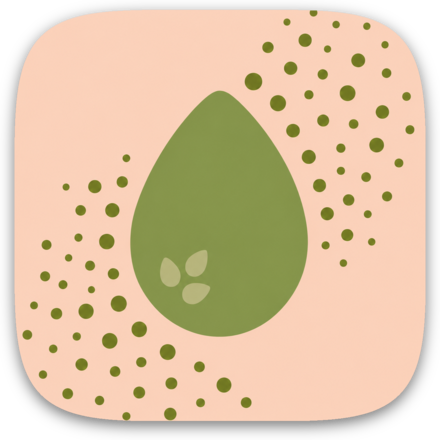
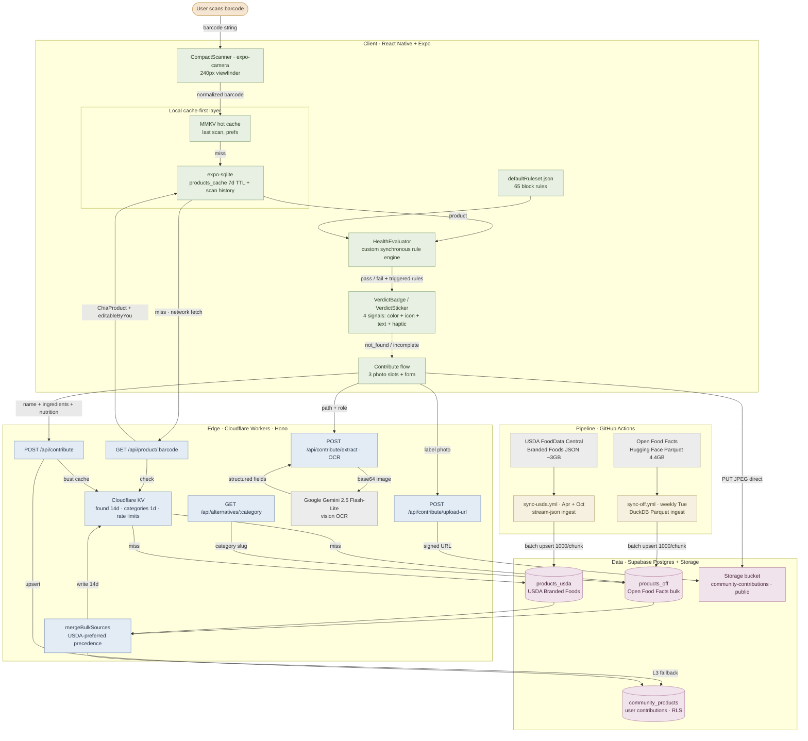
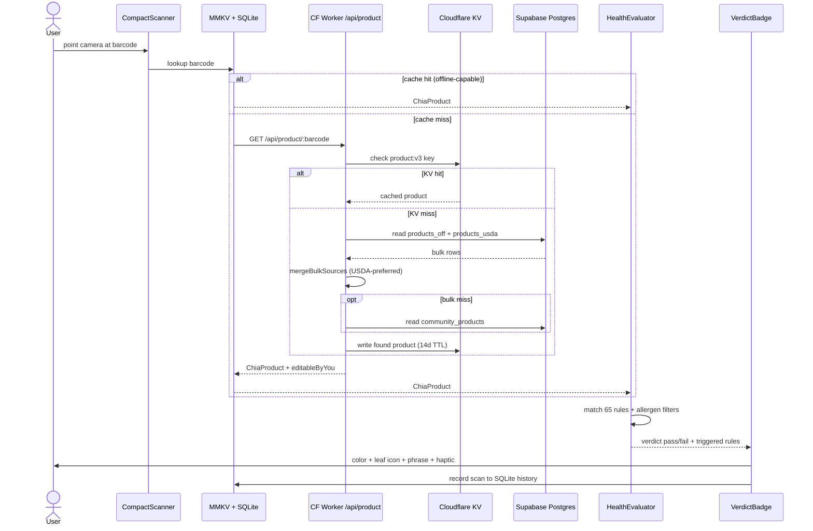

<h1 align="center">Chia</h1>

  

The honest answer to "is this food actually healthy?", in under a second, even offline.

  

  

  
  

Chia is an iOS-first barcode scanner that gives you an instant pass / fail verdict on packaged foods, based on their actual ingredients and additives. Not a vague score, not a paywall, not a five-screen nutrition essay. Point the camera at a barcode; get a warm, honest answer with the reasons behind it.

 

  
  
  
  
  
  
  
  

 

  <a href="#does"><picture><source media="(prefers-color-scheme: dark)" srcset="docs/brand/ui/navbtn-does.dark.svg" /></picture></a>
  <a href="#arch"><picture><source media="(prefers-color-scheme: dark)" srcset="docs/brand/ui/navbtn-arch.dark.svg" /></picture></a>
  <a href="#eng"><picture><source media="(prefers-color-scheme: dark)" srcset="docs/brand/ui/navbtn-eng.dark.svg" /></picture></a>
  <a href="#stack"><picture><source media="(prefers-color-scheme: dark)" srcset="docs/brand/ui/navbtn-stack.dark.svg" /></picture></a>
  <a href="#roadmap"><picture><source media="(prefers-color-scheme: dark)" srcset="docs/brand/ui/navbtn-roadmap.dark.svg" /></picture></a>
  <a href="#more"><picture><source media="(prefers-color-scheme: dark)" srcset="docs/brand/ui/navbtn-more.dark.svg" /></picture></a>

<picture><source media="(prefers-color-scheme: dark)" srcset="docs/brand/title/source.dark.svg" /></picture>

This repository is a public showcase: architecture, design decisions, and engineering write-ups. The application source is private while Chia is in active, pre-launch development.

If you're a recruiter or engineer and want to go deeper, I'm happy to give a live walkthrough or set up a TestFlight build. See the [footer](#more).

<picture><source media="(prefers-color-scheme: dark)" srcset="docs/brand/title/does.dark.svg" /></picture>

Chia is built around one fast, honest interaction.

Scan. An embedded 240px viewfinder reads the barcode. (It's not a full-screen camera; the camera session stops shortly after you leave the tab, so it isn't quietly draining your battery.)

Verdict. The product is matched against a curated rule set on your device and you get a single verdict, delivered through four redundant signals at once:

| Signal | Pass | Fail |
| --- | --- | --- |
| Color | sage | terracotta |
| Icon | animated leaf, upright | animated leaf, wilted, stroke-drawn on entry |
| Text | one of 10 warm phrases ("Great pick!") | one of 10 calm phrases ("Better options out there") |
| Haptic | Light impact on commit | Light impact on commit |

The phrasing is drawn deterministically per scan, so the same scan never flickers between phrases, but the next scan feels fresh. It's warmth-first, never preachy.

Understand. Tap through to the product detail screen for the flagged ingredients, the full ingredient list, nutrition, and the source citation behind every rule that fired.

Didn't find it? Packaged-food databases are never complete. When a barcode isn't found, Chia flips into a contribute flow: snap up to three label photos (front / ingredients / nutrition), and Google Gemini vision OCR extracts structured fields for you to confirm. Your submission is instantly available to the next person who scans it.

<picture><source media="(prefers-color-scheme: dark)" srcset="docs/brand/title/shots.dark.svg" /></picture>

<!-- Drop portrait PNGs in docs/screenshots/ ; filenames below are the wired paths. -->

Screens are being captured; they will land here shortly.

<!-- Real captures pending. Drop portrait PNGs (~1080x2340) into docs/screenshots/ then uncomment:
<table>
  <tr>
    <td align="center" width="33%"> Product detail flagged ingredients + the cited study behind every rule</td>
    <td align="center" width="33%"> History the verdict-rail ledger, grouped by date</td>
    <td align="center" width="33%"> Contribute snap labels &rarr; Gemini OCR fills the form</td>
  </tr>
</table>
-->

<picture><source media="(prefers-color-scheme: dark)" srcset="docs/brand/title/arch.dark.svg" /></picture>

Chia is a client-heavy, offline-first app in front of a serverless edge backend and a self-updating data pipeline. All the fast, private work (scanning, rule evaluation, caching, history) happens on device; the edge exists only to normalize and merge open food data. No third-party API is ever touched directly from the client.

The five pillars:

- Offline-first, cache-first. Every previously scanned product keeps working with no network. Lookup falls through three layers (MMKV hot cache ~0ms → SQLite `products_cache` 7-day TTL ~5-10ms → Cloudflare Worker), and all rule evaluation runs locally.
- Serverless edge backend. A Hono Worker on Cloudflare is the only thing that talks to Open Food Facts, USDA, or Gemini. It's fail-closed by design: a missing secret returns `503` for that endpoint, so a deploy without secrets can never expose an unauthenticated write.
- Self-updating data pipeline. GitHub Actions cron jobs keep the food database fresh with a weekly DuckDB-powered Open Food Facts sync and a biannual streaming USDA sync, all with zero manual intervention.
- Deterministic, explainable rule engine. A custom synchronous evaluator matches products against a 65-rule set where every rule cites a primary regulatory document or peer-reviewed paper. No black box, no LLM guessing your health.
- Crowdsourced OCR contributions. When a product is missing, users can add it with label photos; Gemini vision turns pixels into validated, structured data, and the submission seeds all cache layers instantly.

<picture><source media="(prefers-color-scheme: dark)" srcset="docs/brand/ui/rule.dark.svg" /></picture>

<picture><source media="(prefers-color-scheme: dark)" srcset="docs/brand/title/scan.dark.svg" /></picture>

Sequence diagram: the full scan → verdict path

1. The scanner reads and normalizes a barcode and hands it to the lookup pipeline.
2. MMKV → SQLite → Worker: the first cache hit wins. A hit means an instant, fully-offline verdict.
3. On the edge, the Worker checks its 14-day KV cache, then reads `products_off` and `products_usda` in parallel and merges them (USDA-preferred), falling back to `community_products`. A `not_found` is never cached, so a contribution shows up on the very next scan.
4. Back on device, `HealthEvaluator` matches the product against 65 rules plus your allergen filters and resolves a verdict.
5. The verdict fires with color + leaf icon + phrase + haptic, and the scan is UPSERTed into local history.

The verdict state machine (`deriveVerdict`) collapses lookup status + evaluation result + a data-sparse flag into one of 8 UI states: `pass`, `fail`, `unknown`, `scanning`, `not_found`, `incomplete`, `error_network`, `error_eval`, so every dead end has an honest, designed screen instead of a spinner.

<picture><source media="(prefers-color-scheme: dark)" srcset="docs/brand/ui/rule.dark.svg" /></picture>

<picture><source media="(prefers-color-scheme: dark)" srcset="docs/brand/title/eng.dark.svg" /></picture>

The things a strong engineer notices when they read past the screenshots:

- Explainable rules grounded in real literature. The 65-rule set (`ruleset v1.2`) is curated exclusively from primary sources: the NTP Report on Carcinogens, WHO IARC monographs, McCann et al., Lancet 2007 (food dyes and hyperactivity), Hazen et al., Nature Medicine 2023 (erythritol and cardiovascular risk), and more. Every rule carries its citation into the UI. A product fails if any triggered rule matches or a product allergen matches your filters, and allergen matches are a hard fail that can't be whitelisted.

- A rule engine that was rewritten for the right reasons. `json-rules-engine` was removed and replaced with a custom synchronous evaluator, cutting ~250KB off the bundle, with `RegExp` patterns pre-compiled once per ruleset and cached (O(N) over rules, zero per-scan allocation). Rules match on two facts (`additivesTags` E-numbers, `ingredientsText`) with two operators (`contains`, case-insensitive `matchesRegex`).

- USDA-over-Open-Food-Facts precedence merge. When both sources have a product, USDA wins for nutrition numerics, name, brand, ingredients, categories, and serving size; Open Food Facts fills in `imageUrl`, additives, allergens, Nutri-Score, and NOVA group. A USDA-measured `0` stays `0` rather than being overwritten by a crowdsourced estimate, and USDA's ALL-CAPS bulk text is title-cased while preserving real acronyms (USDA, HFCS, BHT).

- Offline-first data layer with careful cache invalidation. Found products get a 7-day `staleTime`; `not_found` results use `staleTime: 0`, so a contributor's re-scan refetches immediately and shows their submission. A successful contribution seeds all three cache layers at once to kill any stale-data race on the detail screen.

- Anonymous auth done right. The client sends a raw device UUID; the Worker HMAC-SHA256 hashes it (with a salt) before any DB write, so only hashes are ever stored. Re-hashing the requester on read computes an `editableByYou` flag, and the same hash guards photo-upload paths against cross-contributor tampering.

- Security posture. Row-Level Security on every Postgres table (public `SELECT` on bulk tables; service-role-only writes to community data and Storage). Per-IP rate limits (100 req/min global, a separate 10 req/min bucket for contributions). CORS is scoped to the specific methods and headers the app uses; origins are open by design, since Chia's product lookups are a public read API.

- iOS 26 "Liquid Glass" design system. A bespoke glass primitive (`expo-glass-effect`) with 5 material variants and a BlurView + sheen fallback for older iOS, driven entirely by design tokens in `theme/tokens.ts`, with no raw hex and no magic spacing. NativeTabs, Nunito display + Inter body, custom SVG leaf glyphs, and a die-cut verdict "sticker."

- Accessibility baked into the core contract. Verdicts never rely on color alone: color + icon + text + haptic, always, enforced as a component contract.

- TypeScript strict, zero `any`. `any` is forbidden codebase-wide; `unknown` + type guards instead. Pre-commit hooks (Husky + lint-staged) run lint-staged, `tsc` typecheck, and `jest --ci` on every commit.

<picture><source media="(prefers-color-scheme: dark)" srcset="docs/brand/ui/rule.dark.svg" /></picture>

<picture><source media="(prefers-color-scheme: dark)" srcset="docs/brand/title/stack.dark.svg" /></picture>

  

| Layer | Tools |
| --- | --- |
| App runtime | React Native 0.85.3 · Expo SDK 56 · React 19.2.3 · New Architecture + React Compiler |
| Language | TypeScript 6.0.3 (strict, zero `any`) for the app · TypeScript 5.9.2 for the workers |
| Navigation & UI | expo-router NativeTabs · react-native-reanimated 4.3.1 + gesture-handler · `expo-glass-effect` (iOS 26 Liquid Glass, 5 variants) · react-native-svg · Nunito + Inter |
| State & data | Zustand 5.0.14 (2 stores) · TanStack Query 5.100.14 (MMKV-persisted) · react-native-mmkv 4.3.1 · expo-sqlite |
| Edge backend | Cloudflare Workers · Hono 4.6.0 · Wrangler 4.0.0 · Cloudflare KV |
| Data & storage | Supabase Postgres (3 tables, RLS everywhere) · Supabase Storage · Google Gemini 2.5 Flash-Lite (OCR) |
| Pipeline | GitHub Actions cron · DuckDB (Open Food Facts) · stream-json (USDA) |
| Testing & quality | Jest 29.7.0 + @testing-library/react-native (app) · Vitest 2.1.0 (workers) · ESLint 9.25.0 (React Compiler / react-hooks v7) · Husky + lint-staged 17 |

Data pipeline, in numbers

- Open Food Facts, weekly (Tuesday 06:07 UTC). Downloads a 4.4 GB Parquet from Hugging Face, uses DuckDB column-projection filtered to US + CA, batch-upserts in 1,000-row chunks. A recorded run upserted 869,937 rows in 442 seconds.
- USDA Branded Foods, biannual (Apr 16 + Oct 16, 07:23 UTC). Stream-parses a ~3 GB JSON at ~245 rows/sec (~2.5 hours), batch-upserts in 1,000-row chunks.
- Both prune rows older than 365 days to drop delisted products, with aggressive autovacuum tuning to survive the upsert storms.
- OCR runs on Gemini 2.5 Flash-Lite, temperature 0.1, role-specific JSON schemas (front / ingredients / nutrition), numeric outputs bounded to drop hallucinations.

<picture><source media="(prefers-color-scheme: dark)" srcset="docs/brand/ui/rule.dark.svg" /></picture>

<picture><source media="(prefers-color-scheme: dark)" srcset="docs/brand/title/testing.dark.svg" /></picture>

Chia is built like a product, not a prototype.

- 30 test files (20 app Jest suites + 8 worker Vitest suites + 2 sync-script suites) with 400+ test cases (251 app + 156 worker) across ~26 UI components.
- No-throw data layer. Every scan-history function is failure-tolerant: reads return `[]` on error, writes swallow exceptions, so a corrupt SQLite state can't crash the scan loop.
- Pinned behavior. Verdict phrases, the 200-row history prune, and the UPSERT-on-barcode dedup are all asserted in tests, so accidental drift fails loudly in CI.
- Every commit is gated by lint → typecheck → tests via Husky, with ESLint wired to the React Compiler / react-hooks v7 rule set.
- The workers are their own world: separate TypeScript version, separate Vitest suite, separate deploy, so the edge can evolve without destabilizing the app.

<picture><source media="(prefers-color-scheme: dark)" srcset="docs/brand/ui/rule.dark.svg" /></picture>

<picture><source media="(prefers-color-scheme: dark)" srcset="docs/brand/title/roadmap.dark.svg" /></picture>

Honest, forward-looking, and clearly planned, not shipped:

- Allergen preferences UI. The hard-fail allergen evaluation already exists in the engine; this exposes it in Settings and on the detail screen.
- Healthier alternatives. Surface better products when something fails (the `/api/alternatives/:category` Worker endpoint is already live).
- Instant photo verdict on unknown barcodes. Run OCR plus the local rule engine on a label photo to give a verdict even when a barcode isn't in the database.
- Settings buildout. The tab is currently a stub (Allowed ingredients / Account / About marked "Coming soon").
- Animated product-image fallbacks and further product-detail polish.
- Monetization. An OCR usage gate is already scaffolded on the edge (currently disabled).

<picture><source media="(prefers-color-scheme: dark)" srcset="docs/brand/ui/rule.dark.svg" /></picture>

<picture><source media="(prefers-color-scheme: dark)" srcset="docs/brand/title/more.dark.svg" /></picture>

  

Currently exploring how agentic AI changes what a single quality engineer can own.

Chia is a solo-built project in active development. The source is private, but I'd love to show it off. Live walkthrough or TestFlight build, just ask.

  
  

