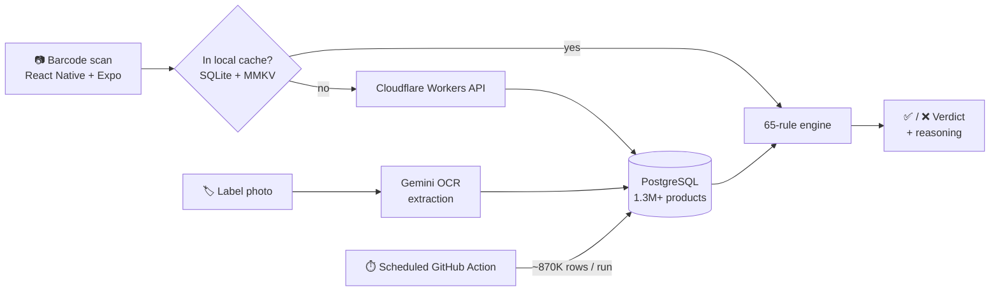

# Chia — Instant Food Barcode Scanner

> Scan a food barcode, get an instant **pass / fail** health verdict — backed by a 65-rule engine and primary nutrition research.

<!-- Replace these with real shields once published -->

> 🔒 **Source code is private.** This repository is a public showcase — architecture, design decisions, and screenshots. Happy to walk through the codebase on request.

---

## 📱 What it does

Most "is this food healthy?" apps bury you in numbers. Chia gives you a single, honest answer the moment you scan:

1. **Scan** a product barcode with the camera.
2. Chia looks it up across **1.3M+ products** and runs it through a **65-rule evaluation engine** grounded in primary nutrition research.
3. You get an instant **pass / fail verdict** — with the *why* behind it — in well under a second, even offline.

If a product isn't in the database, you can **contribute it**: snap the nutrition label and AI-powered OCR extracts the data for you.

<!-- Add 2–3 screenshots or a screen-recording GIF here -->
<!--  -->

---

## 🏗️ Architecture

- **Offline-first** — local scans hit a SQLite + MMKV cache first, so verdicts are instant and work with no signal; the network is a fallback, not a dependency.
- **Serverless backend** — a Cloudflare Workers API proxies and normalizes **USDA** + **Open Food Facts** data into a PostgreSQL store of 1.3M+ products.
- **Self-updating data** — a scheduled GitHub Actions pipeline syncs **~870K rows per run**, keeping the catalog fresh without manual ops.
- **Crowdsourced contributions** — missing products are added via **Gemini-powered OCR** that reads nutrition labels and structures the data.

---

## ✨ Engineering highlights

- **65-rule verdict engine** mapping nutrition research to a deterministic, explainable pass/fail — not a black box.
- **iOS 26 "Liquid Glass" design system** — custom native tab bar, animated verdict stickers, and micro-interactions, built for a fast, tactile feel.
- **Accessibility by design** — every verdict is conveyed through *redundant* channels: color **and** icon **and** text **and** haptics, so it's never color-dependent.
- **Strict engineering rigor** — TypeScript **strict mode (zero `any`)**, Supabase **row-level security**, pre-commit hooks, and a **250+ test Jest suite**.

---

## 🧰 Tech stack

| Layer | Tools |
|---|---|
| App | React Native, Expo, TypeScript (strict) |
| Local data | SQLite, MMKV |
| Backend | Cloudflare Workers (serverless) |
| Database | Supabase / PostgreSQL (row-level security) |
| AI | Gemini (OCR label extraction) |
| Data sources | USDA, Open Food Facts |
| CI/CD & quality | GitHub Actions, Jest (250+ tests), pre-commit hooks |

---

## 🧪 Testing & quality

Quality is the whole point — so the app is built like a tested product, not a prototype:

- **250+ Jest tests** covering the rule engine, data normalization, and core flows.
- **TypeScript strict mode** with zero `any` to catch defects at compile time.
- **Pre-commit hooks** to keep `main` green.
- **Row-level security** so data access is enforced at the database, not just the client.

---

## 📩 Want to see more?

The source is private, but I'm glad to give a live walkthrough or a TestFlight build.
📫 **vkucherko7@gmail.com** · [LinkedIn](https://linkedin.com/in/kucherko)
